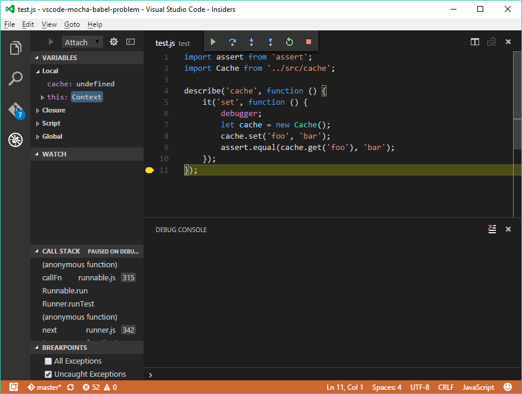

#### VS Code + Mocha + Babel problem

VS Code can't debug tests run through Mocha properly, this repo was created to repro the issue.

#### To Build

    npm install
    npm run build

Launching VS Code using "Launch" breaks initially in the `dist` code

### Minor Problems Debugging Issues with node +external sourcemaps 

    node --debug-brk dist/index.js

... and attach with node, or just `Launch` from with VS Code

Stepping once switches to source code

Continuing to step through code sometimes switches back to the compiled code, then back to source. 

When control flow enters the "cache.js" module it correctly shows the source code, at the correct position, until the end of the module, when it switches back to compiled code before exiting.

Generally debugging works this way, though: with the exception of occasionally showing the compiled code, the code position is correct. 

### Significant Problems Debugging in Mocha

Debug inline source maps generated JIT by Mocha. Babel options 

    mocha --debug-brk test

(there's a mocha.opts that adds babel compiler already)

* debugger doesn't stop on "debugger" statements, but some other place in the file
* breakpoints don't work as expected
* symbols not available

### Compared to Node Inspector Behavior

In another process..

    node-inspector

Then...

    mocha --debug-brk test

##### Node inspector also initially shows compiled code

After the first step, it switches to the source as VS Code does. *However, it never shows compiled code again.*

It correctly steps through the inner function as VS Code does, however, the code position will jump to the first line of a function right before exiting.

##### Node inspector works with source map created JIT by mocha

This is the first screen after attaching with Node Inspector when running `mocha --debug-brk test`:

Stepping through the entire test causes no unexpected behavior.

#### Notes

* Babel `sourceMaps` must be `inline` or `both` in order for node-inspector to work 
* Node inspector produces nicer output with "inline" source maps (no `function` wrapper around each module)
* VS Code does not work with only "inline" source maps, but does with with "both"
* When sourcemaps are not available, node-inspector correctly debugs the compiled code. VS Code shows the ES6 source, but with the breakpoints in the wrong place.